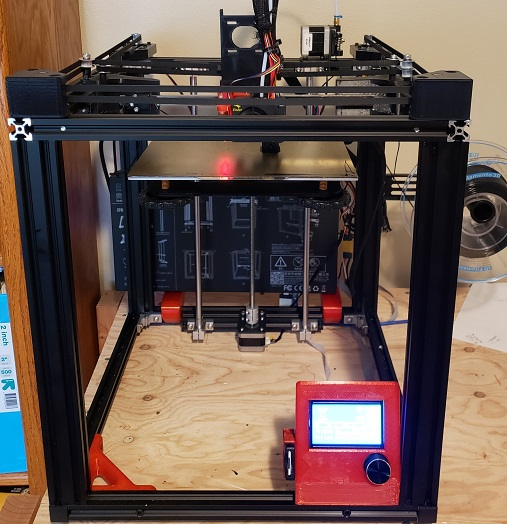

# Ender5_Corexy_Project

__****PROTOTYPE!  This is a work in progress :-)****__

# Credits

First off this is a remix of two ideas I found on Thingiverse and I would like to give these individuals credit for their work:

__Greg191134: Ender 4 Corexy Conversion on Thingiverse__

https://www.thingiverse.com/thing:2686559

This is the base of the conversion.  It is almost a like-for-like when going from and Ender 4 to an Ender 5 but some adjustments had to be made.  Either way this was a great starting point!
 
__Kookaburra88: Creality Ender 4 - Linear Rail CoreXY + Belt Driven Dual Z__

https://www.thingiverse.com/thing:3331662

This design helped me get what I wanted in my X-Axis Linear Rail setup.  I am not a fan of the rail lying flat or on a piece of 2020.  Again a little modification but overall I really like it.

# BOM
ToDo: Fill in 

# Instructions
ToDo: Fill in 
